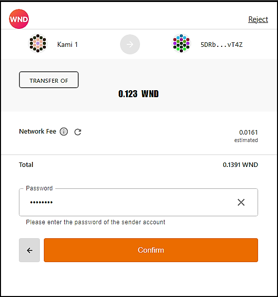
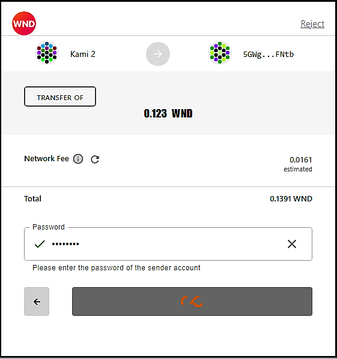
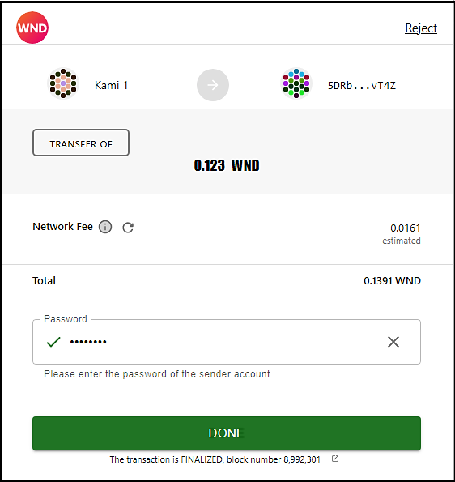

# 

A user-friendly wallet to interact with the Polkadot/Substrate based blockchains through a browser. It allows users to access their Polkadot account(s), which can also be used to interact with decentralized apps.

It is based on polkadot js extension, which injects a [@polkadot/api](https://github.com/polkadot-js/api) signer into a page, along with any associated accounts.

Polkadot js plus extension is actually the original polkadot js extension, plus some new functionalities.

## New functinalities

Currently, the following features are added:
  - View balances
  - Transfer funds
  - View an address as QR code
  - Staking / unstaking / redeem funds and edit nominated validator list
  - Contribute in crowdloans

## Installation (Development version)

Steps to build the extension and view your changes in a browser:

1. Build via `yarn build` or `yarn watch`
2. Install the extension
  - Chrome:
    - go to `chrome://extensions/`
    - ensure you have the Development flag set
    - "Load unpacked" and point to `packages/extension/build`
    - if developing, after making changes - refresh the extension
  - Firefox:
    - go to `about:debugging#addons`
    - check "Enable add-on debugging"
    - click on "Load Temporary Add-on" and point to `packages/extension/build/manifest.json`
    - if developing, after making changes - reload the extension

Once added, you can create an account (via a generated seed) or import via an existing seed.

## How To's

Accounts page, shows the list of all accounts and their balances which you have created/imported on polkadot/kusama blockchain and parachains.

To Transfer funds, first add a recepient, you can even choose a recepient from you own accounts to transfer between your accounts:

While Choosing an amount to transfer, the extension shows appropriate alerts based on your input. Click on Safe Max to withdraw all from your account while still keeping your account active.

In transaction confirmation page, confirm the transaction to broadcast it on the blockchain by entering your sending account's password.

After a little while, depend on the network response time, transaction will be done, you see the following page and your balance(s) are updated.

<!--  -->

Transactions' histroy can be seen from the account page, which shows transactions detail, status, failure reason  if transaction failed, and a link to subscan for more info.

Entering the crypto address is error prone, so it is useful to use the QR code for scanning by a mobile wallet.

Now, you can easily stake using the polkadot JS Plus extension. you just need enter the amount you want to stake and choose auto mode, it will do the rest.

View your nominated validators info, even edit the list of the validators.

Nominate validators automatically or select them yourself.

Finaly confirm staking/unstaking/redeem similarly.

Contribution in crowdloans now is possible via the extension, go to 'contribute in crowdloans' menu:

 
Choose the relay chain, view the active crwdloans, select one:

 
Do contribute and confirm it.

